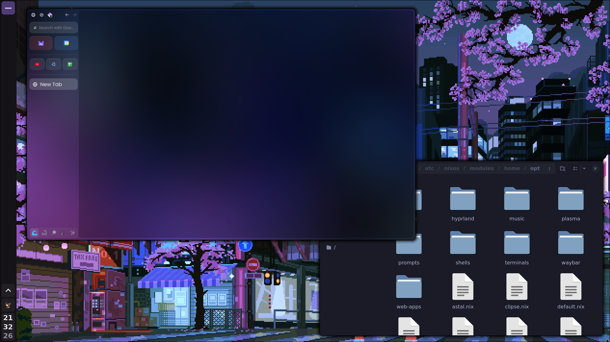
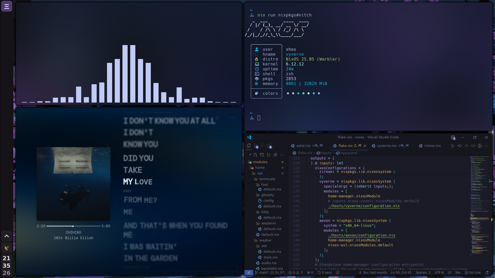
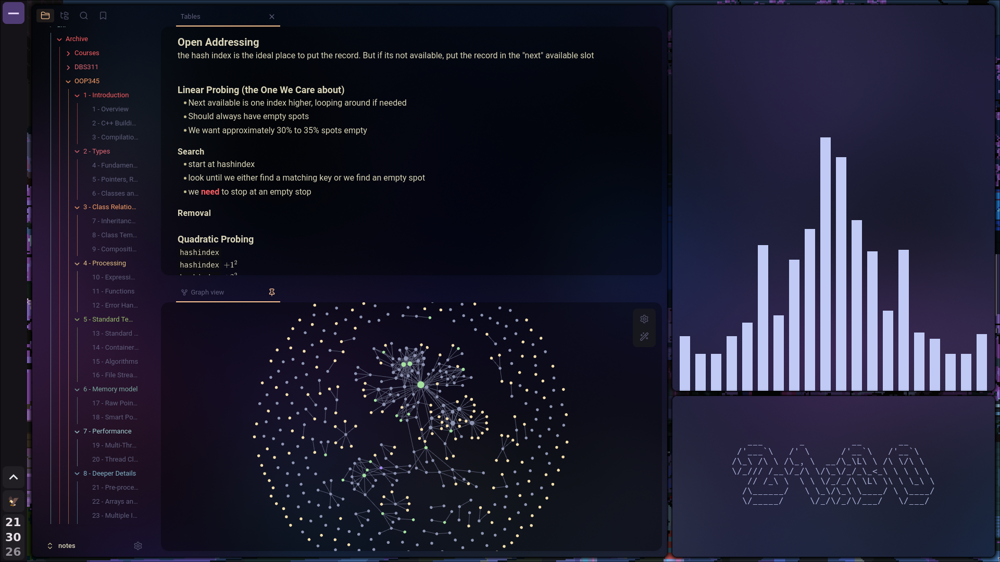
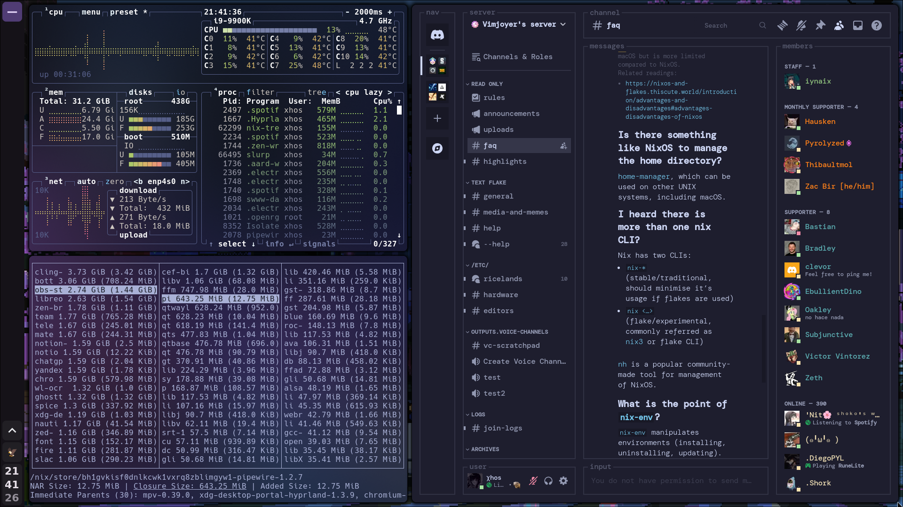

# ❄️ nix

this repo contains... a lot. desktop configs, a homelab running a fully declarative  *arr stack + jellyfin + home assistant + a dozen other things, three OCI cloud instances with the whole infrastructure managed via OpenTofu, custom NixOS qcow2 images built from the flake, and a bunch of custom modules. secrets via sops-nix, automatic per-host module loading via import-tree, impermanence on most machines, and stylix theming that covers pretty much everything.

<details>
<summary>old screenshots</summary>

## old setup using [aard](https://github.com/xhos/aard)

<p float="left">
  
   
  
  
</p>

</details>

all wallpapers can can be found [here](https://pics.xhos.dev/folder/cmgs64vh4000amzfs6t7oqy3f)

## homelab

[enrai](./systems/enrai) is my headless optiplex 5050 running a bunch of cool things, ~99% declarative. zsh, impermanence, secrets, all that good stuff:

- fully declarative *arr stack thanks to [upidapi's](https://github.com/upidapi) [declarr](https://github.com/upidapi/declarr). (tho i use [my own fork](https://github.com/xhos/declarr) of it for some extra features)
- networking: caddy reverse proxy with cloudflare acme + nat port forwarding over wirguard to the vps running my [nix-wg-proxy](https://github.com/xhos/nix-wg-proxy)
- home assistant: yandex station max controlling wled and [wled-album-sync](https://github.com/xhos/wled-album-sync)
- proxmox-nix running 2 vms, one for game servers, other for amnezia vpn (the only not fully declarative part)
- zipline, wakapi, synthing, glance and more

## cloud (OCI free tier)

three instances, all running NixOS via custom-built qcow2 images:

| host    | shape      | specs            | role                                                                               |
| ------- | ---------- | ---------------- | ---------------------------------------------------------------------------------- |
| arashi  | A1.Flex    | 4 core ARM, 24GB | general purpose                                                                    |
| mizore  | E2.1.Micro | 1 core x86, 1GB  | hosts [null](https://github.com/xhos/null-core)                                    |
| proxy-1 | E2.1.Micro | 1 core x86, 1GB  | forwards traffic to enrai via [nix-wg-proxy](https://github.com/xhos/nix-wg-proxy) |

infrastructure is fully declarative via [OpenTofu](https://opentofu.org).

images are built with `nix build` from the flake and uploaded to OCI object storage:

```sh
# ARM (arashi)
nix build .#packages.aarch64-linux.a1-flex-image

# x86 (mizore, proxy-1)
nix build .#packages.x86_64-linux.e2-micro-image
```

applying configs to running instances:

```sh
nixos-rebuild switch --flake .#mizore --target-host root@mizore
nixos-rebuild switch --flake .#arashi --target-host root@arashi
```

## repo structure

- **[flake.nix](./flake.nix):** main entrypoint, defines system and home configurations
- **[lib/](./lib):** custom Nix library functions and builders (e.g., `import-tree`)
- **[modules/](./modules):**
  - **[home/](./modules/home):** home-manager modules
    - **[core/](./modules/home/core):** essential user configurations
    - **[opt/](./modules/home/opt):** optional and toggleable modules (apps, cli tools, bar, wms, etc)
  - **[nixos/](./modules/nixos):** system-level modules
    - **[core/](./modules/nixos/core):** base system configs
    - **[opt/](./modules/nixos/opt):** optional and toggleable modules (impermanence, nvidia config, etc)
- **[pkgs/](./pkgs):** custom packages and derivations
- **[systems/](./systems):** per-host NixOS configurations and keys
- **[terraform/](./terraform):** OpenTofu infrastructure definitions for OCI free tier


## info

| component          | details                                                 |
| ------------------ | ------------------------------------------------------- |
| de/wm              | [hyprland](https://hypr.land/)                          |
| greeter            | [yawn](https://github.com/xhos/yawn) (i made this!)     |
| terminal           | [foot](https://codeberg.org/dnkl/foot)                  |
| shell              | [zsh](https://www.zsh.org/)                             |
| bar                | [waybar](https://github.com/Alexays/Waybar)             |
| browser            | [zen](https://zen-browser.app)                          |
| runner             | [rofi](https://github.com/davatorium/rofi)              |
| prompt             | [starship](https://starship.rs/)                        |
| file manager       | [nautilus](https://apps.gnome.org/Nautilus/)            |
| notification       | [mako](https://github.com/emersion/mako)                |
| clipboard manager  | [clipse](https://github.com/savedra1/clipse)            |
| fetch              | [fastfetch](https://github.com/fastfetch-cli/fastfetch) |

## hyprlock

| name | preview | sources |
| :--- | :--- | :--- |
| **Main (Animated)** |  | [config](https://github.com/xhos/nix/tree/9692b91df9fa7896a59af807010780d1c9bffad7/modules/home/opt/hypr/hyprlock/hyprlock.conf) <br> [assets](https://github.com/xhos/nix/tree/9692b91df9fa7896a59af807010780d1c9bffad7/modules/home/opt/hypr/hyprlock/assets/) <br> [scripts](https://github.com/xhos/nix/tree/9692b91df9fa7896a59af807010780d1c9bffad7/modules/home/opt/hypr/hyprlock/scripts/) <br> [fonts](https://github.com/xhos/nix/tree/9692b91df9fa7896a59af807010780d1c9bffad7/modules/home/core/fonts/font-files) |
| **Alternative (Static)** |  | [config](https://github.com/xhos/nix/tree/9692b91df9fa7896a59af807010780d1c9bffad7/modules/home/opt/hypr/hyprlock/hyprlock-alt.conf) <br> [assets](https://github.com/xhos/nix/tree/9692b91df9fa7896a59af807010780d1c9bffad7/modules/home/opt/hypr/hyprlock/assets/) <br> [scripts](https://github.com/xhos/nix/tree/9692b91df9fa7896a59af807010780d1c9bffad7/modules/home/opt/hypr/hyprlock/scripts/) <br> [fonts](https://github.com/xhos/nix/tree/9692b91df9fa7896a59af807010780d1c9bffad7/modules/home/core/fonts/font-files) |

fonts used are:

- Maratype (credit to @notevencontestplayer on discord)
- KH Interference
- Synchro
- Nimbus Sans L Thin
- Nimbus Sans Black

## themed apps

> [!note]
> most of these automatically follow the stylix color scheme

- discord:  [system24](https://github.com/refact0r/system24)
- firefox:  [scifox](https://github.com/scientiac/scifox)
- obsidian: [anuppuccin](https://github.com/AnubisNekhet/AnuPpuccin)
- spotify:  [text](https://github.com/spicetify/spicetify-themes/tree/master/text)
- and more that i'm forgetting...

## acknowledgments

- [@joshuagrisham](https://github.com/joshuagrisham) for his work on [the galaxy book driver](https://github.com/joshuagrisham/samsung-galaxybook-extras)
- [@itzderock](https://github.com/ItzDerock) for sharing their [nix derivation](https://github.com/joshuagrisham/samsung-galaxybook-extras/issues/14#issue-2328871732) for that driver (now irrelevant since it was merged upstream)
- [@elyth](https://github.com/elythh), my config started as a fork of theirs [flake](https://github.com/elythh/flake)
- [hyprstellar](https://github.com/xeji01/hyprstellar/tree/main) for icons and general style inspiration
- and many more awesome people of the nix community. I have a lot of inline attribution comments added around the codebase
